[TOC]

# Unity 界面布局

好的~让我们继续上一篇的内容，创建的工程如……下面这张吧（别问为什么版本更新了，也别问为什么变黑了 XD）

Unity的基本界面布局包括菜单栏、工具栏以及5个常用的视图窗口，分别为Hierarchy（层级）、Project（项目）、Inspector（检查器）、Scene（场景）和Game（游戏）视图（当然还有Console控制台，不过不常……常……不说了）

对于非猿来说，这样讲可能显得过于僵硬，那么换下图

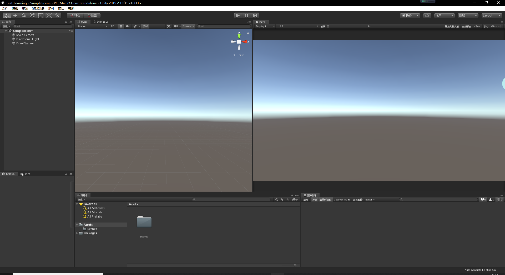

这样是不是就符合大众口味了呢

类似其他编辑软件，Unity中窗口的位置是可以随意拖拽排布的

------

下面，请允许我来逐一介绍一下这几个视图窗口

## Hierarchy视图

Unity的Hierarchy视图窗口里，包含了每一个当前场景的所有游戏对象（GameObject）

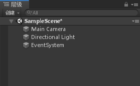

默认工程里，基本就是一行粗的三行细的，俗话说得好，三个臭嗨……（啪）

咳咳……三个对象是什么先不用了解，最上边粗的那行，代表了当前激活的场景（Hierarchy里可以有很多个场景，但是只有一个粗……激活的）

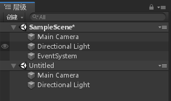

 其中一些是资源文件的实例，如 3D 模型和其他预制物体（Prefab，暂不需要理解）的实例，可以在 Hierarchy 视图中选择对象或者生成对象。

 当在场景中增加或者删除对象时，Hierarchy 视图中相应的对象则会出现或消失。 

网上我见过一些说法，说这个视图里，对象是按字母顺序排列的，这个不·要·信。

还有，如果是创建新的游戏对象，或者是复制已有的对象，Unity是会自动在名字后边加上编号的，就如同我们复制文件夹一样，但是，Unity并不是不允许同名的游戏对象存在，仅仅是不推荐（被打不管的那种），中文命名也是同理

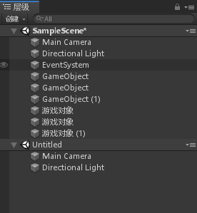

这里有个好玩的事，父子关系

   

这个词形容的是一种级别观念，即父物体中可以存在多个子物体，子物体中还可以存在多个子物体……俄罗斯套娃了解一下。在此介绍一个最基础的用处：我有一个钥匙（配吗），移动很简单；我有一串钥匙，整体移动很简单，挑几个移动还能接受；我有一个仓库，里边有50个钥匙盒，每个盒里有6个袋，袋里有5串钥匙……请分别挑出每个袋中的一串钥匙进行移动。这种情况，用父子关系就可以很简单的解决（仓库→钥匙盒→袋→钥匙串），因为父物体的移动，是会同时影响到其子物体的（和子物体的子物体，和子物体的子物体的子物体……）

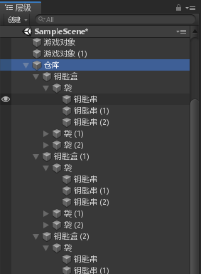

层级视图还有一个很巧妙的功能，就是顶端那行细细的搜索栏，可以通过输入名字，检索到视图中所有匹配的游戏对象（这就是创建同名对象挨打的原因）

------

## Project视图

Project 视图显示资源目录下所有可用的资源列表，相当于一个资源仓库，用户可以使用它来访问和管理项目资源。

每个 Unity 的项目包含一个资源文件夹，其内容将呈现在 Project 视图中，如下图所示。这里存放着游戏的所有资源，例如场景、脚本、三维模型、纹理、音频文件和预制组件。

如果在 Project 视图里单击某个资源，可以在资源管理器中找到其对应的文件本身。 

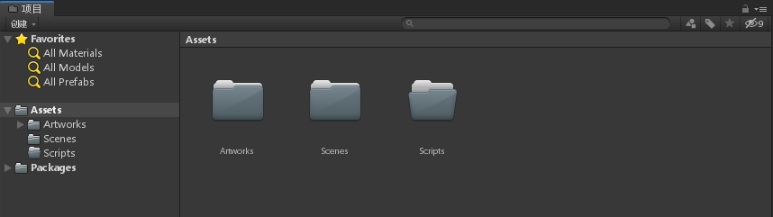

 Project 视图左侧显示当前文件夹的层次结构，当选中一个文件夹时，它的内容就会显示在右侧。对于显示的资源，可以从其图标看出它的类型，如脚本、材质、子文件夹等。

 可以使用视图底部的滑块调节图标的显示尺寸，当滑块移动到最左边时，资源就会以层次列的形式显示出来。当进行搜索时，滑块左边的空间就会显示资源的完整路径。  

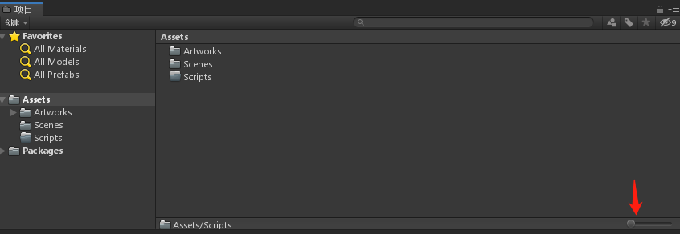

Project视图也拥有检索用的细条条

 在 Project 视图中，顶部有一个浏览器工具条。左边是 创建 菜单，单击则会开启与 Assets 菜单下 创建 命令相同的功能。

 游戏开发者可以通过 创建 菜单创建脚本、材质、动画、UI等资源。 

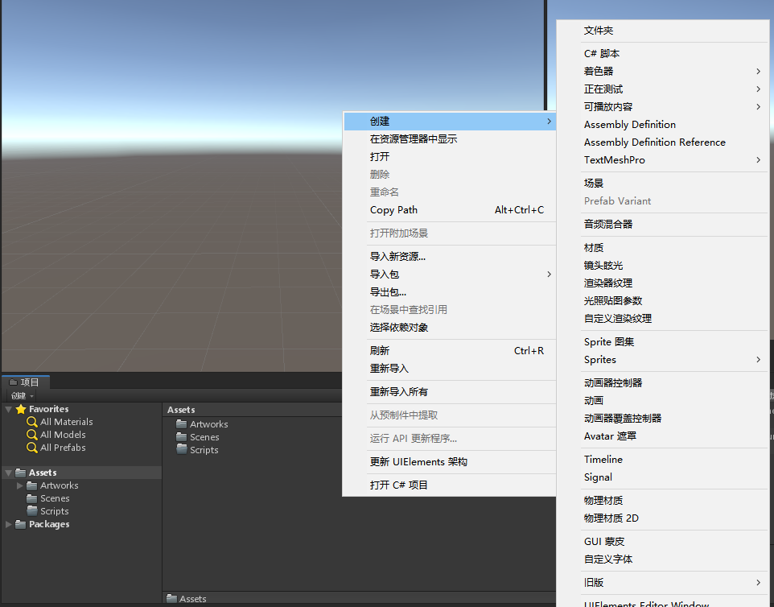

如上图所示，在 Project 视图中，左侧顶部是一个名为 Favorites（收藏）的面板，在此处可以保存要经常或频繁访问的资源，这样可以更方便地访问它们。

可以从项目文件夹层次中拖动文件夹到此处，也可以将搜索结果保存到此处。 

------

## Inspector视图

Inspector 视图用于显示当前选定的游戏对象的所有附加组件（脚本属于组件）及其属性的相关详细信息（真的不是我懒，这个视图就是个赛百味热狗，长啥样子的都有）。 

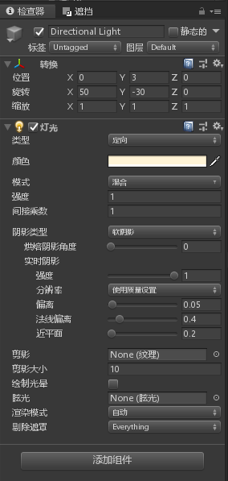

但是，他也有必须拥有的组件-Transform（转换），这个组件主要是显示游戏对象的位置、旋转（角）、缩放信息，是必不可少的，就算是空物体，也至少会有这个组件。 

   

------

## Scene视图

Scene 视图是交互式沙盒，是对游戏对象进行编辑的可视化区域，游戏开发者创建游戏时所用的模型、灯光、相机、材质、音频等内容都将显示在该视图中。 

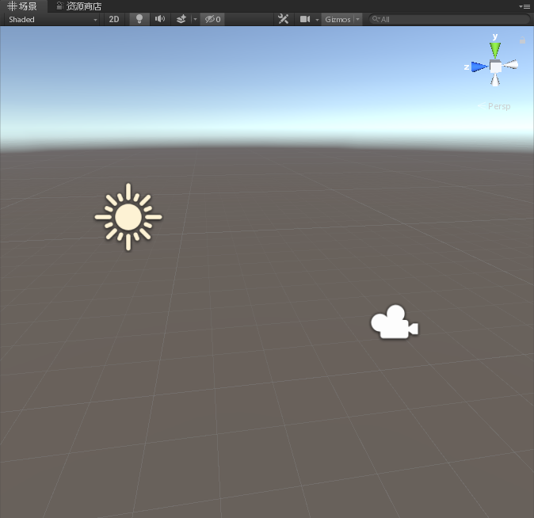

目前项目里只有一个平行光和一个相机，这两种对象会被Unity以图标的形式展示到Scene视图中

Scene视图有很多种模式：

| Shaded           | 着色模式（默认模式） | 所有游戏对象的贴图都正常显示 |
| ---------------- | -------------------- | ---------------------------- |
| Wireframe        | 网格线框显示模式     | 以网格线框形式显示所有对象   |
| Shaded Wireframe | 着色模式线框         | 以贴图加网格线框形式显示对象 |
| Shadow Cascades  | 阴影级联             | 以阴影方式显示对象           |
| Render Paths     | 渲染路径显示模式     | 以渲染路径的形式显示         |
| Alpha Channel    | Alpha通道显示        | 以灰度图的方式显示所有对象   |
| Overdraw         | 以半透明方式显示     | 以半透明的方式显示所有对象   |
| Mipmaps          | MIP映射图显示        | 以MIP映射图方式显示所有对象  |

当然，这些**不重要**（才怪）

   

Scene视图顶端有4个小按钮，用处分别为： 切换 2D 与 3D 视图 ；场景灯光的开启（使用“场景”照明）或关闭（使用连接到“场景”视图相机的灯光） ； 控制场景中声音的打开与关闭 ； 控制场景中天空球、雾效、光晕等组件的显示与隐藏 

------

## Game视图

Game 视图用于显示最后发布的游戏的运行画面，游戏开发者可以通过此视图进行游戏的测试。  单击播放按钮后，游戏开发者可以在 Game（游戏）视图中进行游戏的预览，并且可以随时中断或停止测试……实在是编不下去了，搞一个说明表吧

| 参 数            | 含 义            | 功 能                                                        |
| ---------------- | ---------------- | ------------------------------------------------------------ |
| Free Aspect      | 自由比例（默认） | 调整屏幕显示比例，默认为自由比例                             |
| Maximize on Play | 运行时最大窗口   | 切换游戏运行时最大化显示场景                                 |
| Mute audio       | 静音             | 控制游戏在运行预览时静音                                     |
| Stats            | 统计             | 单击此按钮，弹出Statistics面板，显示运行场景的渲染速 度、帧率、内存参数等内容 |
| Gizmos           | 设备             | 单击其右侧的三角符号可以显示或隐藏场景中的灯光、声 音、相机等游戏对象图标 |

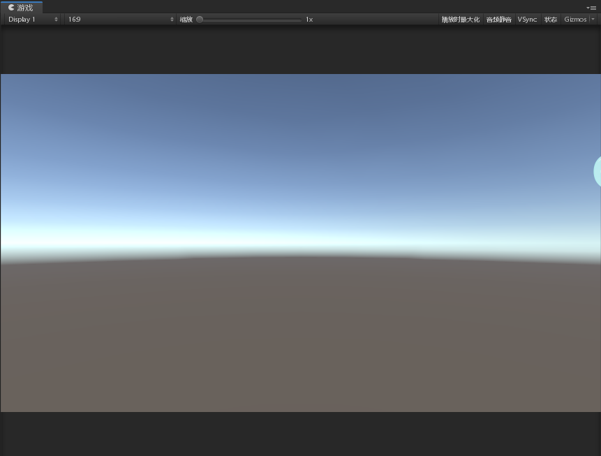

------

## 菜单栏

Unity 3D 菜单栏包含 File（文件）、Edit（编辑）、Assets（资源）、GameObject（游戏对象）、Component（组件）、Window（窗口）和 Help（帮助）7 组菜单，如下图所示。 

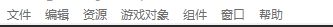

### File菜单

File 菜单主要用于打开和保存场景项目，同时也可以创建场景，具体功能及快捷键如下表所示。 

| 命 令                      | 功 能                      | 快捷键           |
| -------------------------- | -------------------------- | ---------------- |
| New Scene（新建场景）      | 创建一个新的场景           | Ctrl + N         |
| Open Scene（打开场景）     | 打开一个已经创建的场景     | Ctrl + O         |
| Save Scene（保存场景）     | 保存当前场景               | Ctrl + S         |
| Save Scene As（另存场景）  | 将当前场景另存为一个新场景 | Ctrl + Shift + S |
| New Project（新建项目）    | 新建一个项目               | 无               |
| Open Project（打开项目）   | 打开一个已经创建的项目     | 无               |
| Save Project（保存项目）   | 保存当前项目               | 无               |
| Build Settings（发布设置） | 项目发布的相关设置         | Ctrl + Shift + B |
| Build & Rim（发布并执行）  | 发布并运行项目             | Ctrl + B         |
| Exit （退出）              | 退出 Unity 3D              | 无               |

### Edit 菜单

Edit 菜单用于场景对象的基本操作（如撤销、重做、复制、粘贴）以及项目的相关设置，具体功能及快捷键如下表所示。

| 命 令                          | 功 能                                      | 快捷键           |
| ------------------------------ | ------------------------------------------ | ---------------- |
| Undo（撤销）                   | 撤销上一步操作                             | Ctrl + Z         |
| Redo（重做）                   | 重做上一步操作                             | Ctrl + Y         |
| Cut（剪切）                    | 将对象剪切到剪贴板                         | Ctrl + X         |
| Copy（复制）                   | 将对象复制到剪贴板                         | Ctrl + C         |
| Paste（粘贴）                  | 将剪贴板中的对象粘贴到当前位置             | Ctrl + V         |
| Duplicate（复制）              | 复制并粘贴对象                             | Ctrl + D         |
| Delete（删除）                 | 删除对象                                   | Shift + Del      |
| Frame Selected（缩放窗口）     | 平移缩放窗口至选择的对象                   | F                |
| Look View to Selected（聚焦）  | 聚焦到所选对象                             | Shift + F        |
| Find（搜索）                   | 切换到搜索框，通过对象名称搜索对象         | Ctrl + F         |
| Select All（选择全部）         | 选中所有对象                               | Ctrl + A         |
| Preferences（偏好设置）        | 设定 Unity 3D 编辑器偏好设置功能相关参数   | 无               |
| Modules（模块）                | 选择加载 Unity 3D 编辑器模块               | 无               |
| Play （播放）                  | 执行游戏场景                               | Ctrl + P         |
| Pause（暂停）                  | 暂停游戏                                   | Ctrl + Shift + P |
| Step（单步执行）               | 单步执行程序                               | Ctrl + Alt + P   |
| Sign In（登录）                | 登录到 Unity 3D 账户                       | 无               |
| Sign Out（退出）               | 退出 Unity 3D 账户                         | 无               |
| Selection（选择）              | 载人和保存已有选项                         | 无               |
| Project Settings（项目设置）   | 设置项目相关参数                           | 无               |
| Graphics Emulation（图形仿真） | 选择图形仿真方式以配合一些图形加速器的处理 | 无               |
| Network Emulation（网络仿真）  | 选择相应的网络仿真方式                     | 无               |
| Snap Settings（吸附设置）      | 设置吸附功能相关参数                       | 无               |

###  Assets 菜单

 Assets 菜单主要用于资源的创建、导入、导出以及同步相关的功能，具体功能及快捷键如下表所示。

| 命 令                                                        | 功 能                                                        | 快捷键 |
| ------------------------------------------------------------ | ------------------------------------------------------------ | ------ |
| Create（创建）                                               | 创建资源（脚本、动画、材质、字体、贴图、物 理材质、GUI 皮肤等） | 无     |
| Show In Explorer（文件夹显7K）                               | 打开资源所在的目录位置                                       | 无     |
| Open（打开）                                                 | 打开对象                                                     | 无     |
| Delete（删除）                                               | 删除对象                                                     | 无     |
| Open Scene Additive（打开添加的场景）                        | 打开添加的场景                                               | 无     |
| Import New Asset（导入新资源）                               | 导人新的资源                                                 | 无     |
| Import Package（导人资源包）                                 | 导人资源包                                                   | 无     |
| Export Package（导出资源包）                                 | 导出资源包                                                   | 无     |
| Find References in Scene（在场景中找出资源）                 | 在场景视图中找出所选资源                                     | 无     |
| Select Dependencies（选择相关）                              | 选择相关资源                                                 | 无     |
| Refresh（刷新）                                              | 刷新资源                                                     | 无     |
| Reimport （重新导入）                                        | 将所选对象重新导入                                           | 无     |
| Reimport All（重新导人所有）                                 | 将所有对象重新导入                                           | 无     |
| Run API Updater（运行 API 更新器）                           | 运行 API 更新器                                              | 无     |
| Open [C#](http://c.biancheng.net/csharp/) Project（与 MonoDevelop 项目同步） | 开启 MonoDevelop 并与项目同步                                | 无     |

###  GameObject 菜单

 GameObject 菜单主要用于创建、显示游戏对象，具体功能及快捷键如下表所示。

| 命 令                                        | 功 能                                                        | 快捷键           |
| -------------------------------------------- | ------------------------------------------------------------ | ---------------- |
| Create Empty（创建空对象）                   | 创建一个空的游戏对象                                         | Ctrl + Shift + N |
| Create Empty Child（创建空的子对象）         | 创建其他组件（摄像机、接口文字与几何物 体等）                | Alt + Shift + N  |
| 3D Object（3D 对象）                         | 创建三维对象                                                 | 无               |
| 2D Object（2D 对象）                         | 创建二维对象                                                 | 无               |
| Light（灯光）                                | 创建灯光对象                                                 | 无               |
| Audio（声音）                                | 创建声音对象                                                 | 无               |
| UI（界面）                                   | 创建 UI 对象                                                 | 无               |
| Particle System（粒子系统）                  | 创建粒子系统                                                 | 无               |
| Camera （摄像机）                            | 创建摄像机对象                                               | 无               |
| Center On Children（聚焦子对象）             | 将父对象的中心移动到子对象上                                 | 无               |
| Make Parent（构成父对象）                    | 选中多个对象后创建父子对象的对应关系                         | 无               |
| Clear Parent（清除父对象）                   | 取消父子对象的对应关系                                       | 无               |
| Apply Change To Prefab（应用变换到预制体）   | 更新对象的修改属性到对应的预制体上                           | 无               |
| Break Prefab Instance （取消预制实例）       | 取消实例对象与预制体直接的属性关联 关系                      | 无               |
| Set As First Sibling                         | 设置选定子对象为所在父对象下面的第一个子对象                 | Ctrl + =         |
| Set As Last Sibling                          | 设置选定子对象为所在父对象下面的最后一个子对象               | Ctrl + -         |
| Move To View（移动到视图中）                 | 改变对象的 Position 的坐标值，将所选对象  移动到 Scene 视图中 | Ctrl + Alt + F   |
| Align With View（与视图对齐）                | 改变对象的 Position 的坐标值，将所选对象  移动到 Scene 视图的中心点 | Ctrl + Shift + F |
| Align View To Selected（移动视图到选中对象） | 将编辑视角移动到选中对象的中心位置                           | 无               |
| Toggle Active State（切换激活状态）          | 设置选中对象为激活或不激活状态                               | Alt + Shift + A  |

###  Component 菜单

 Component 菜单主要用于在项目制作过程中为游戏物体添加组件或属性，具体功能及快捷键如下表所示。

| 命 令                     | 功 能                                | 快捷键           |
| ------------------------- | ------------------------------------ | ---------------- |
| Add（新增）               | 添加组件                             | Ctrl + Shift + A |
| Mesh（网格）              | 添加网格属性                         | 无               |
| Effect（特效）            | 添加特效组件                         | 无               |
| Physics （物理属性）      | 使物体带有对应的物理属性             | 无               |
| Physics 2D（2D 物理属性） | 添加 2D 物理组件                     | 无               |
| Navigation（导航）        | 添加导航组件                         | 无               |
| Audio（音效）             | 添加音频，可以创建声音源和声音的听者 | 无               |
| Rendering（這染）         | 添加渲染组件                         | 无               |
| Layout（布局）            | 添加布局组件                         | 无               |
| Miscellaneous（杂项）     | 添加杂项组件                         | 无               |
| Event（事件）             | 添加事件组件                         | 无               |
| Network（网络）           | 添加网络组件                         | 无               |
| UI（界面）                | 添加界面组件                         | 无               |
| Scripts（脚本）           | 添加 Unity 3D 脚本组件               | 无               |
| Image Effect（图像特效）  | 摄像机控制                           | 无               |

###  Window 菜单

 Window 菜单主要用于在项目制作过程中显示 Layout（布局）、Scene（场景）、Game（游戏）和 Inspector（检视）等窗口，具体功能及快捷键如下表所示。

| 命 令                         | 功 能                                      | 快捷键             |
| ----------------------------- | ------------------------------------------ | ------------------ |
| Next Window（下一个窗口）     | 显示下一个窗口                             | Ctrl + Tab         |
| Previous Window（前一个窗口 ) | 显示前一个窗口                             | Ctrl + Shift + Tab |
| Layouts（布局窗口）           | 显示页面布局方式，可以根据需要自行调整     | 无                 |
| Scene（场景窗口 )             | 显示用于编辑制作游戏的窗口                 | Ctrl + 1           |
| Game（游戏窗口）              | 显示用于测试游戏的窗口                     | Ctrl + 2           |
| Inspector（检视窗口 )         | 主要用于控制各个对象的属性，也称为属性面板 | Ctrl + 3           |
| Hierarchy（层次窗口）         | 显示用于整合游戏对象的窗口                 | Ctrl + 4           |
| Project（项目窗口）           | 显示游戏资源存放的窗口                     | Ctrl + 5           |
| Animation（动画窗口）         | 显示用于创建时间动画的窗口                 | Ctrl + 6           |
| Profiler（探查窗口）          | 显示用于分析探查的窗口                     | Ctrl + 7           |
| Asset Server（资源服务器）    | 显示用于链接资源服务器的窗口               | 无                 |
| Console（控制台）             | 显示控制台窗口，用于调试错误               | Ctrl + Shift + C   |

###  Help 菜单

 Help 菜单主要用于帮助用户快速学习和掌握 Unity 3D，提供当前安装的 Unity 3D 的版本号，具体功能及快捷键如下表所示。

| 命 令                               | 功 能                                | 快捷键 |
| ----------------------------------- | ------------------------------------ | ------ |
| About Unity（关于 Unity）           | 提供 Unity 3D 的安装版本号及相关信息 | 无     |
| Manage License（软件许可管理）      | 打开 Unity 3D 软件许可管理工具       | 无     |
| Unity Manual（Unity 教程）          | 连接至 Unity 官方在线教程            | 无     |
| Scripting Reference（脚本参考手册） | 连接至 Unity 官方在线脚本参考手册    | 无     |
| Unity Service（Unity 在线服务平台） | 连接至 Unity 官方在线服务平台        | 无     |
| Unity Forum（Unity 论坛）           | 连接至 Unity 官方论坛                | 无     |
| Unity Answers（Unity 问答）         | 连接至 Unity 官方在线问答平台        | 无     |
| Unity Feedback（Unity 反馈）        | 连接至 Unity 官方在线反馈平台        | 无     |
| Check for Updates（检査更新）       | 检查 Unity 3D 版本更新               | 无     |
| Download Beta（下载Beta版安装程序） | 下载 Unity 3D 的 Beta 版安装程序     | 无     |
| Release Notes（发行说明）           | 连接至 Unity 官方在线发行说明        | 无     |
| Report a Bug（问题反馈）            | 向 Unity 官方报告相关问题            | 无     |

###  其他快捷键

 除上述菜单中的快捷键以外，还有以下一些常用的快捷键。

| 功能                         | 快捷键         |
| ---------------------------- | -------------- |
| 显示当前选择                 | F              |
| 在视窗的两列中转换焦点       | Tab            |
| 定位当前焦点到搜索栏         | Ctrl / Cmd + F |
| 选择列中所有可见项目         | Ctrl / Cmd + A |
| 复制选择的资源项目           | Ctrl / Cmd + D |
| 删除对象，将弹出确认提示框   | Delete         |
| 删除对象，但不弹出确认提示框 | Delete + Shift |
| 对资源进行重命名             | F2             |
| 打开选择的资源               | Enter          |
| 跳转到父文件夹中             | Backspace      |
| 扩展选择的项目               | →              |
| 瓦解选择的项目               | ←              |
| 当资源显示为预览时扩展项目   | Alt + →        |
| 当资源显示为预览时瓦解项目   | Alt + ←        |

------

## 工具栏

 工具栏（Toolbar）中，一共包含 13 种常用工具，如下表所示。 

| 图 标                                                        | 工具名称         | 功 能                                                       | 快捷键   |
| ------------------------------------------------------------ | ---------------- | ----------------------------------------------------------- | -------- |
| 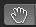 | 平移窗口工具     | 平移场景视图画面                                            | 鼠标中键 |
|  | 位移工具         | 针对单个或两个轴向做位移                                    | W        |
| 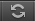 | 旋转工具         | 针对单个或两个轴向做旋转                                    | E        |
| 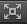 | 缩放工具         | 针对单个轴向或整个物体做缩放                                | R        |
| 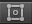 | 矩形手柄         | 设定矩形选框                                                | T        |
| 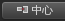 | 变换坐标轴模式   | 与 Pivot 切换显示，以对象中心轴线为参考轴做移动、旋转及缩放 | 无       |
| 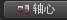 | 变换坐标轴模式   | 与 Center 切换显示，以网格轴线为参考轴做移动、 旋转及缩放   | 无       |
| 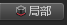 | 变换轴向         | 与 Global 切换显示，控制对象本身的轴向                      | 无       |
| 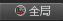 | 变换轴向         | 与 Local 切换显示，控制世界坐标的轴向                       | 无       |
|  | 播放             | 播放游戏以进行测试                                          | 无       |
| 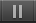 | 暂停             | 暂停游戏并暂停测试                                          | 无       |
|  | 单步执行         | 单步进行测试                                                | 无       |
| 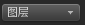 | 图层下拉列表     | 设定图层                                                    | 无       |
| 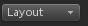 | 页面布局下拉列表 | 选择或自定义 Unity 3D 的页面布局方式                        | 无       |

------

以上便是对Unity界面布局的基础介绍，当这些窗口框框都弄明白是什么意思之后，就可以开始尝试开发我们的项目了

